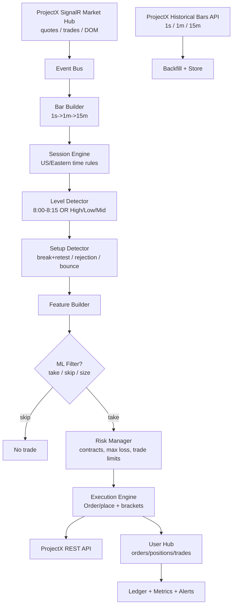
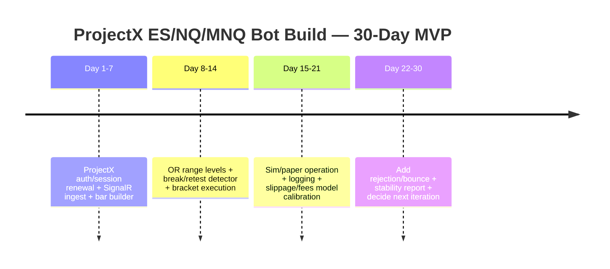

iturn25image0turn29image0turn29image2turn29image4
# RP Profits, ProjectX, and an AI-Driven ES/NQ/MNQ Trading System Spec

## Executive summary

RP Profits is a retail trading influencer whose public brand centers on a repeatable “one candle / opening range” approach framed as “liquidity-based” scalping, marketed primarily through his entity["company","YouTube","video platform"] channel and entity["company","Instagram","social network"] presence. His Instagram bio presents him as entity["people","Reece Phillips","trader entrepreneur"] and includes a large follower base and “not financial advice” messaging. citeturn6search1turn6search4

For automation, the key operational constraint is that “ProjectX” is not a single prop firm—it is a platform provider. The platform’s own documentation and help center show a full-featured API (REST + WebSocket/SignalR) that supports historical bars (second/minute/hour/day/week/month), real-time quotes/trades/DOM, and bracket-capable order placement in ticks. citeturn4view0turn3view1turn4view2turn12view2

However, ProjectX publicly announced it is winding down its third‑party partner offering, continuing support for partners that are sunsetting only through **February 28, 2026**, and directing traders to TopstepX to continue using the platform. This materially affects any plan to build a long-lived bot on “ProjectX-funded accounts” unless your funded program is on TopstepX (or you have written confirmation your firm remains supported). citeturn1view0turn0search34

If your funded accounts are on TopstepX, the most consequential compliance constraint is that TopstepX’s API Access documentation explicitly states automation activity must originate from the trader’s own device and prohibits using VPS/VPN/remote servers; running automation on a VPS can result in suspension/removal. That single rule can invalidate a “host it on a VPS” design for TopstepX accounts. citeturn2view4

A rigorous build path is therefore:

- Standardize RP Profits’ rules into a deterministic signal engine (8:00–8:15 ET range, break/retest, rejection, bounce), and treat ML strictly as a *filter* (meta-labeling) rather than the primary signal generator, to reduce overfitting risk. citeturn6search11turn7search3turn10search3  
- Implement ProjectX execution with a bracket-first order model (ticks-based SL/TP), respecting platform rate limits and token lifetimes. citeturn4view0turn3view0turn12view0  
- Backtest with walk-forward evaluation and conservative slippage/fees; do not rely on in-sample equity curves, as backtests are highly susceptible to false discovery and overfitting. citeturn10search0turn10search2  

## Biography and public persona

RP Profits’ public ecosystem is anchored on three surfaces: video education/marketing, social short-form content, and a paid community funnel.

His entity["company","TradingView","charting platform"]-adjacent marketing frequently frames trading as a repeatable system and often highlights large daily/weekly/yearly profit figures in content titles/descriptions. Examples include titles/descriptions referencing “$28,447 last week,” “$750k last year,” and similar claims; these are *claims in marketing copy*, not audited track records. citeturn7search3turn7search19turn6search36

On Instagram, the profile snippet shows ~371K followers and describes “Trader/Entrepreneur” and “Not financial advice, everything is my opinion,” which is consistent with a creator who mixes trading education with lifestyle/entrepreneurship positioning. citeturn6search1turn6search17

Monetization and community appear to route through entity["company","Whop","digital product marketplace"] and a branded community named entity["organization","Profit Insider","trading community brand"]. Whop’s product snippet shows “Profit Insider Premium” priced at **$99/month** and high ratings, and additional high-ticket products (e.g., a “Blueprint” product shown at $4,999.99 in the accessible listing snippet). citeturn6search2turn6search10

Secondary sources (forums and Reddit) show mixed sentiment: some members report value and rapid progress, while other posts allege refund friction or mismatch between advertised mentorship and delivered value. These are anecdotal signals that matter mainly if you plan to commercialize a derivative product or rely on community claims as evidence of performance. citeturn6search6turn6search14turn6search24

## Trading strategy specification for ES, NQ, and MNQ

This section translates the publicly described “one candle / ORB” approach into an implementable spec for ES, NQ, and MNQ. The goal is to be explicit about what is known, what must be assumed, and what remains unspecified.

### Instruments and session anchors

RP Profits’ short-form content explicitly references using the **15‑minute timeframe** on ES futures and marking “the first 15‑minute candle at **8 AM Eastern Standard Time**.” citeturn6search39turn6search11  
He also references an “eight to 8:15 AM opening range breakout strategy” and emphasizes a constrained trading window (commonly stated as trading from about **9 AM to 11 AM Eastern**, with additional posts/screens suggesting a broader window reaching ~11:30). citeturn6search3turn7search11turn7search0

**Known (explicitly stated):**
- Session anchor: 8:00–8:15 AM ET “opening range” candle/range concept. citeturn6search39turn6search11  
- Typical execution window: ~9:00–11:00 AM ET (and frequently referenced 11:30 boundary in posts). citeturn7search11turn7search0  

**Unspecified (must be chosen by you):**
- Whether the same anchor is used for NQ/MNQ vs ES (highly likely, but not stated in the accessible snippets).  
- Whether instruments are traded simultaneously or one “primary” is selected based on volatility/liquidity.  
- Exact “trend” definition used as a filter (he references “liquidity” framing, but trend mechanics are not fully specified in the accessible snippets). citeturn6search36turn7search28

### Setups and rule translation

Public clips and titles point to three main setup families: break/retest, rejection, bounce. The most detailed phrasing available in accessible snippets indicates the “8 a.m break and retest strategy” and that it is meant to be executed with simple steps and a high-level risk/reward framing (e.g., a video description claims ~50%+ win rate and ~1:4 average risk-to-reward). citeturn6search11turn7search3

Because not all details are fully visible from primary sources due to access throttling, the following should be treated as a “strict minimal spec” (what’s publicly named) plus explicitly marked assumptions required to automate.

**Level construction (high confidence):**
- Define the “opening range” as the 8:00–8:15 ET bar on a 15-minute chart.
- Compute `OR_high`, `OR_low`, and `OR_mid = (OR_high + OR_low)/2`. citeturn6search39turn6search11

**Setup logic (implementable form):**

| Setup | Public description support | Deterministic trigger definition (recommended) | What remains unspecified |
|---|---|---|---|
| Break + retest | “8 a.m break and retest strategy” / “break to upside, look for retest… enter” citeturn6search11turn6search7 | Break = a 1m or 5m candle close beyond `OR_high` (long) or `OR_low` (short) by ≥ *break_buffer* ticks; Retest = price trades back into a tolerance band around the broken level; Entry = on retest confirmation (e.g., reclaim candle close). | Exact candle timeframe for confirmation; whether midpoint is used as the retest target; what constitutes “confirmation” beyond “retest.” |
| Rejection | “Failing to close above” style language appears in accessible secondary discussion and aligns with common ORB rejection framing. citeturn6search19turn6search7 | Touch = price trades into ±*level_tolerance* ticks of the level; Rejection = N consecutive closes fail to accept beyond the level (e.g., close back below a high); Entry = opposite direction on confirmation. | Number of candles; wick/volume qualifiers; whether rejection uses OR levels only or also other session levels. |
| Bounce | Named as the inverse of rejection in common ORB systems; the “bounce” label appears in community and RP-related tooling references. citeturn7search6turn6search7 | Touch into level band; Bounce confirmation = close away from the level with minimum displacement (ticks) and/or reclaim; Entry in direction of bounce; Stop behind invalidation (below/above swing). | Exact invalidation rule; whether the strategy prefers immediate entry or second-entry (retest) logic. |

### Stops, targets, risk-to-reward, and sizing

A YouTube description claims this “8 a.m candle scalping strategy” has ~50%+ win rate and ~1:4 average risk-to-reward; treat this as an unverified promotional claim. citeturn7search3

Given the lack of fully visible primary rule text, the only “safe” automation approach is to implement stop/target logic as **parameterized** in ticks, derived from:
- the instrument’s tick size/tick value
- the opening-range width (OR range)
- and a fixed risk budget per trade (e.g., $X risk per trade). citeturn3view2turn4view0turn12view2

**Unspecified in accessible primary sources (must be decided):**
- Whether stops/targets are fixed-tick (e.g., 20-tick stop, 80-tick target) or structure-based (behind swing);  
- Whether partial scaling is used;  
- Position sizing rules (“1 contract always” vs risk-based sizing).

A robust funded-account implementation should default to conservative risk (often 0.1%–0.5% of trailing drawdown/day), but the precise fraction depends on your prop program’s drawdown model and contract limits. The platform itself provides mechanisms to enforce trade limits and daily loss limits, but your specific “funded rules” still come from the prop firm. citeturn13view2turn13view1

## ProjectX platform rules, funded-account constraints, and API mechanics

### ProjectX availability and partner sunset risk

ProjectX’s own website states it is winding down third‑party service offerings for most partners and will continue supporting partners who are sunsetting through **February 28, 2026**, directing traders to TopstepX thereafter. citeturn1view0  
A secondary industry report describes a similar narrative (ProjectX ending licensing broadly, with Topstep as the primary continuing path). citeturn0search34

**Implication:** if your funded accounts are with a non‑Topstep ProjectX partner, there is material platform continuity risk. Your bot architecture should assume you may have to migrate from “ProjectX partner A” to TopstepX (or to an entirely different broker/API) on short notice. citeturn1view0turn1view2

### ProjectX data feed and infrastructure constraints

ProjectX’s help center states it is a licensed CME data redistributor, maintains its own direct feed, and hosts primary market-data servers in **Northern Virginia** with global acceleration/backhaul; it also states the web app can refresh market data at ~50ms on “fast.” citeturn9view1

This has two important engineering consequences:

- Low-latency “colocation near CME” is not the only latency driver; your network path to ProjectX’s Virginia data plants matters for the *data you see* and the responsiveness of its platform delivery. citeturn9view1turn10search11  
- Exchange matching for CME products still occurs in Aurora; CME’s own colocation page describes the Aurora facility housing Globex matching engines. citeturn10search11turn10search3

### ProjectX API capabilities and limits

**API access and scope:** ProjectX’s API page states an active API subscription is required and gives access across ProjectX environments (including whitelabels). citeturn1view1turn2view3

**Authentication and token lifetime:** The Gateway API uses JWT session tokens; validated tokens are only valid for 24 hours and must be renewed via `/api/Auth/validate`. citeturn12view1turn12view0

**Rate limits:** `POST /api/History/retrieveBars` is limited to 50 requests / 30 seconds; all other endpoints are limited to 200 requests / 60 seconds, with HTTP 429 on exceed. citeturn3view0

**Market data granularity and retrieval:**
- Historical bar endpoint supports `unit` values: second, minute, hour, day, week, month, with a max 20,000 bars per request. citeturn3view1  
- The real-time API uses Microsoft SignalR over WebSocket and provides a `market` hub capable of streaming quotes, trades, and market depth (DOM events). citeturn4view2

**Order placement and order types:** `/api/Order/place` supports Market, Limit, Stop, TrailingStop, JoinBid, JoinAsk, and allows stop-loss and take-profit bracket objects specified in **ticks**. citeturn4view0  
ProjectX’s risk settings docs also explain bracket order type conventions (risk bracket via stop market; profit bracket via limit), which aligns with setting bracket legs in a funded environment to ensure protection is always attached. citeturn13view3

**ES, NQ, MNQ contract mapping in ProjectX:**
- Contract search examples show NQ and MNQ with explicit tick size/value and “activeContract” flags (e.g., `CON.F.US.ENQ.U25` for NQ and `CON.F.US.MNQ.U25` for MNQ). citeturn3view2  
- Real-time quote payload examples show ES-like symbol IDs (e.g., `symbolId: "F.US.EP"` and `symbolName: "/ES"`), which is useful for mapping internal identifiers. citeturn4view2

### ProjectX platform risk controls that interact with automation

ProjectX provides platform-level risk controls including:
- Manual lock-out that liquidates positions and cancels working orders, and cannot be reversed. citeturn5view0  
- Contract limits that reject orders exceeding per-symbol limits and explicitly state that bracket orders do not count toward the contract limit. citeturn13view0  
- Trade limits that can block opening new positions and may be irreversible for the day/week; trade limits are ignored on follower accounts in the trade copier. citeturn13view1  
- Personal daily loss limit options including “Liquidate and Block” until next trading day. citeturn13view2  

These mechanisms can be used as “last line of defense,” but a bot should not depend on them; it should enforce stricter internal risk rules. citeturn13view2turn5view0

### TopstepX ProjectX API compliance constraints

If your ProjectX funded accounts are under TopstepX, Topstep’s API Access document explicitly states:
- there is no sandbox environment
- the subscription includes real-time market data
- and critically: all trading activity must originate from the trader’s own device and the use of VPS/VPN/remote servers is “strictly prohibited,” with enforcement consequences. citeturn2view4

This is the dominant constraint for infrastructure design under TopstepX. citeturn2view4turn1view0

## System architecture for an RP-style bot on ProjectX

The system should be engineered as a deterministic rules engine plus an optional ML filter. The reason is statistical: iterative strategy tuning in finance can easily produce false positives; rigorous validation and conservative assumptions are essential. citeturn10search2turn10search10

### Modules and responsibilities

**Data ingestion**
- Real-time: SignalR `market` hub for quote/trade/depth; builds internal tick stream and/or second bars. citeturn4view2  
- Historical: `/api/History/retrieveBars` for second/minute/hour bars for backfill and backtesting. citeturn3view1turn3view0  

**Time/session engine**
- Enforces US/Eastern session boundaries for the 8:00–8:15 anchor candle and the “trade window” constraint. citeturn6search39turn7search11  
- Handles rollover: ProjectX claims it automatically rolls during 4–5pm CST; your bot should still re-resolve the active contract daily via contract search. citeturn9view0turn3view2  

**Level detection**
- Computes OR range (high/low/mid) as soon as the 8:15 candle closes. citeturn6search39turn6search11  
- “Untested high/low” logic is not fully specified in accessible primary sources; treat as a configurable module (e.g., prior day high/low, overnight high/low, session high/low). (Unspecified; must be assumed.)

**Setup detector**
- Implements break/retest, rejection, bounce with strict definitions and tolerances in ticks. citeturn6search11turn6search7  

**Risk manager**
- Position sizing: convert desired $risk to contracts using instrument tick value (NQ vs MNQ differ materially). citeturn3view2  
- Enforce daily max loss, max trades/day, max exposure by symbol (align with ProjectX contract limits, but stricter). citeturn13view0turn13view1  

**Execution engine**
- Uses `/api/Order/place` with bracket objects (ticks-based SL/TP) and enforces idempotency via customTag uniqueness. citeturn4view0turn4view2  
- Reconciliation loop: subscribe to user hub for order/position updates and confirm bracket placement, fills, cancels. citeturn4view2turn4view3  

**Logging and audit**
- Append-only event log: signals, feature snapshots, order intents, order acknowledgements, fills, PnL.  
- Required for debugging, and essential if you later publish performance claims (regulated promotional standards exist for futures). citeturn10search0turn10search20  

### Candidate ML filter (optional)

A practical ML role is meta-labeling: predict whether a detected setup is worth taking (or how to size it), rather than predicting direction outright. This reduces the degrees of freedom and can help mitigate overfitting. citeturn10search2turn10search10

**Models to consider**
- Logistic regression / calibrated linear models for interpretability
- Gradient-boosted trees for tabular features (common in practice; model class choice is an engineering recommendation, not a claim about guaranteed profitability)

**Feature ideas aligned to the public method**
- OR range size; normalized OR range (range / recent volatility)
- Distance to OR high/low/mid in ticks
- Break strength: number of closes beyond level, maximum excursion beyond level, time to retest
- Time-of-day features (9:00–11:30 window granularity)
- Microstructure filters: spread proxy from bestBid/bestAsk; DOM imbalance proxies (if using depth events) citeturn4view2turn7search11

### Architecture diagram



## Development stack and tool comparison

Your stack depends on whether you are allowed to run code on a server (VPS) or must run locally (TopstepX constraint). citeturn2view4turn1view0

### Comparison table of ≥5 candidate stacks

| Stack | Approx. cost | Pros | Cons | Suitability for ProjectX + funded ES/NQ/MNQ |
|---|---:|---|---|---|
| Python + aiohttp + SignalR client + Postgres/Parquet | Low | Fast iteration; strong data tooling; good ML ecosystem | Need robust SignalR integration; careful async engineering | Strong for a rules-first bot; good path to ML filter citeturn4view2turn4view0 |
| .NET (C#) + SignalR + EF Core + SQL/Timescale | Low–medium | SignalR is native; clean typing; production-grade services | ML workflow less ergonomic unless you add Python interop | Excellent fit because ProjectX real-time uses SignalR citeturn4view2 |
| Node.js + @microsoft/signalr + Redis + ClickHouse | Medium | Strong real-time handling; simple deployment | ML pipeline usually external; numeric handling careful | Good for streaming + execution; ML as separate service citeturn4view2 |
| Python backtesting platform + custom ProjectX adapter (NautilusTrader/Lean-style) | Medium | Unified backtest→live patterns; better simulation discipline | More build time; adapter maintenance risk if ProjectX changes | Good if you plan multi-year iteration and strict testing citeturn3view1turn4view0turn1view0 |
| “Automation bridge” (TradersPost/PickMyTrade) + your signal server | Medium | Reduces execution plumbing; faster to production | Dependency risk; less control; still must follow prop rules | Useful as a stopgap if you can’t maintain execution code citeturn0search14turn0search16 |
| Local-only bot (mini PC) + ProjectX API (TopstepX compliant mode) | Low–medium | Can comply with “own device only” constraints | Less uptime than VPS unless you engineer home reliability | Required design if TopstepX prohibits VPS citeturn2view4turn5view3 |

## Data, labeling, backtesting, and evaluation protocols

### Data granularity and historical needs

ProjectX supports historical bars down to **1-second** aggregation via `retrieveBars`, and real-time tick-like trade events and depth updates via the market hub. citeturn3view1turn4view2

For an ORB system, minimum viable:
- 1-minute and 15-minute bars (to define OR and detect break/retest)
- second bars or trade events can improve realism and execution simulation

Historical requirements (practical engineering estimate):
- At least 6–12 months for initial feasibility tests
- 2–5 years for stability checks across regimes (especially for NQ volatility changes)

The API’s 20,000-bar per request limit and rate limits mean you must design a batching/backfill system rather than naive per-day queries. citeturn3view1turn3view0

### Setup labeling with triple-barrier

A directly compatible labeling scheme is:

- **Entry time** = when your deterministic engine triggers a trade
- **Upper barrier** = TP (in ticks), derived from R:R and stop
- **Lower barrier** = SL (in ticks)
- **Time barrier** = max holding time (e.g., 15–60 minutes, aligned to intraday intent)

Label = which barrier hits first (TP, SL, neither by time limit). This produces clean supervised labels for an ML filter while still respecting the strategy’s bracket-first nature. citeturn4view0turn13view3turn7search3

### Backtesting and evaluation requirements

For funded accounts, the biggest failure mode is “paper edge” disappearing after slippage, fees, and rule constraints. For automated trading more broadly, regulators and industry guidance emphasize risk controls and operational safeguards. citeturn10search2turn10search10

Minimum evaluation protocol:
- Walk-forward testing (train on earlier period, validate on later; do not randomly shuffle time-series)
- Conservative slippage modeling that worsens during the open
- Fees/commissions included in net metrics
- Stratified reporting by instrument (ES vs NQ vs MNQ), because tick value and volatility differ materially citeturn3view2turn4view2

Metrics to track (funded-account relevant):
- Max intraday drawdown, max trailing drawdown hits
- Profit factor, expectancy per trade, average MAE/MFE
- Win rate and average win/loss; distribution tails
- “Rule violations”: attempted orders rejected by contract limits or trade limits (these become *risk events*) citeturn13view0turn13view1turn4view0

## Compliance, legal, and operational constraints

### ProjectX terms and platform rules

ProjectX’s Terms of Use (Aug 7, 2025) emphasize the company may change or discontinue services, disclaims uninterrupted availability, and restricts use largely to personal use while prohibiting abusive load or scraping. This matters for bot engineering (rate limits, reliability assumptions, and continuity risk). citeturn8view0turn3view0turn1view0

### Funded-account and automation policy constraints

Because “funded accounts via ProjectX” can mean many different firms, the exact trading rules (drawdown model, scaling, news rules) are **unspecified** unless you name the firm. That said, there is a critical TopstepX-specific constraint:

- TopstepX API Access: prohibits VPS/VPN/remote servers; requires automation on your own device; orders via API are final and not eligible for adjustment; Topstep does not provide integration support. citeturn2view4

If you are not on TopstepX, you must obtain and archive the firm’s written policy on: automation allowed, copy trading allowed, VPS allowed, and what constitutes “third-party trading” or prohibited trading practices. (Unspecified; depends on firm.) citeturn1view2turn1view0

### Performance/advertising claims

If you ever publish performance (even as a “bot results” page), you enter a higher standard of disclosure. NFA Compliance Rule 2‑29 addresses communications with the public and requires prominent statements such as “past results are not necessarily indicative of future results” when referencing past profits, and imposes conditions on presenting past performance statistics. citeturn10search0turn10search20

If you present yourself as advising clients or otherwise fall under SEC adviser marketing rules, additional restrictions apply to hypothetical/backtested performance. citeturn10search1turn10search13

## Costs, timeline, roadmap, and 30‑day minimal viable experiment

### Itemized costs (prototype → production)

Costs depend strongly on whether you can use a VPS (non-TopstepX) or must run locally (TopstepX). citeturn2view4turn1view0

| Cost item | Prototype (monthly) | Production (monthly) | Notes |
|---|---:|---:|---|
| ProjectX API subscription | ~$29 | ~$29 | TopstepX doc states $29/mo and mentions a discount code; API billed separately. citeturn2view4turn2view3 |
| Compute | $0–$50 | $0–$150 | Local mini PC (TopstepX-compliant) vs VPS if allowed; TopstepX explicitly bans VPS. citeturn2view4turn5view3 |
| Storage | $0–$20 | $10–$100 | Depends on tick/DOM archiving vs 1m bars only |
| Monitoring (alerts) | $0–$20 | $10–$50 | Email/SMS/uptime monitoring |
| Dev time | high | high | The dominant cost is engineering hours, testing gates, and ongoing maintenance. citeturn8view0turn3view0 |

### Step-by-step implementation roadmap with gates

| Phase | Deliverable | Pass/fail gate |
|---|---|---|
| Scope lock | Written spec: OR definitions, trade window, all thresholds in ticks | No discretionary terms remain without definitions (e.g., “confirmation,” “trend”) citeturn6search39turn7search11 |
| Data layer | Market hub ingest + bar builder + historical backfill | Correct timestamps; stable reconnect; no rate-limit violations citeturn4view2turn3view0turn3view1 |
| Strategy engine v1 | Deterministic ORB break/retest only | 200+ backtest trades with conservative costs; no lookahead bugs |
| Execution v1 | Bracket order placement + reconciliation | Brackets always attached; idempotency via customTag; zero “orphaned positions” citeturn4view0turn4view2 |
| Paper/sim | Live signals to a simulated account | 2–4 weeks ops stability; kill-switch tested via lock-out behaviors citeturn5view0turn12view2 |
| Live micro | MNQ-first deployment | 30 trading days without drawdown rule breach; consistent logging |
| ML filter | Meta-labeling model | Improves out-of-sample drawdown or return stability; no degradation in live ops |

### 30-day minimal viable experiment

Goal: validate whether a strict, rules-first implementation has any *net* edge after realistic costs and ProjectX execution constraints—before adding ML.

**Days 1–7**
- Implement ProjectX connections (Auth + Validate session + market hub + account search). citeturn12view0turn12view2turn4view2  
- Build 1m and 15m bars from real-time and confirm that 8:00–8:15 ET OR candle matches expected values. citeturn6search39turn3view1  

**Days 8–14**
- Implement level builder + break/retest detector only.
- Implement bracket orders in ticks using `/api/Order/place` with stopLossBracket and takeProfitBracket. citeturn4view0turn13view3  

**Days 15–21**
- Paper trade (or sim account): record every signal and its outcome; compute slippage proxy from bestBid/bestAsk at entry time. citeturn4view2turn13view0  

**Days 22–30**
- Add rejection and bounce detectors only if break/retest results are stable.  
- Produce a “go/no-go” report: net expectancy per trade, max drawdown, rejected order rate, trade-limit interactions, and time-of-day performance. citeturn13view1turn3view0turn7search11

### Timeline diagram



### Risks, failure modes, and mitigations

| Risk | Failure mode | Mitigation |
|---|---|---|
| Platform sunset | Non-Topstep partner loses ProjectX support after Feb 28, 2026 | Build broker-agnostic interfaces; plan migration; confirm your firm’s status in writing citeturn1view0turn0search34 |
| TopstepX VPS prohibition | Bot runs on VPS → account suspension/removal | If TopstepX: run locally only; engineer local reliability (UPS, watchdog) citeturn2view4turn5view3 |
| Orphaned risk | Position opened without brackets attached | Bracket-first order design and reconciliation; kill-switch triggers lock-out on inconsistency citeturn4view0turn5view0 |
| Rate limits / throttling | Data gaps, delayed bars, missed orders | Batch historical pulls; stream real-time; observe 429 handling and backoff citeturn3view0turn4view2turn3view1 |
| Overfitting | Great backtest, fails live & violates drawdown | Walk-forward testing; conservative slippage; keep ML as a filter only citeturn10search2turn10search10 |
| Funded rule mismatch | Strategy triggers orders that violate contract limits/trade limits | Integrate platform risk settings; enforce stricter internal limits; monitor rejections citeturn13view0turn13view1 |

## Primary-source link index

You asked for links to all primary sources found and used. URLs are included verbatim.

```text
RP Profits primary sources
https://www.youtube.com/@RP.Profits1
https://www.youtube.com/watch?v=sXtmM_KQYiM
https://www.youtube.com/watch?v=sM56cLgQCxQ
https://www.youtube.com/watch?v=jQja3NJ_qWg
https://www.instagram.com/rp.profits/
https://www.instagram.com/reel/DRIOcnugXB9/
https://www.instagram.com/reel/DUYree0AU8V/
https://www.instagram.com/reel/DMoKS4JygUT/

Profit Insider / Whop primary sources
https://whop.com/profit-insider/?funnelId=product_42975288-9ab1-4e71-bce7-f95840e99002
https://whop.com/profit-insider/profit-insider-blueprint/?funnelId=product_42975288-9ab1-4e71-bce7-f95840e99002&utm_source=store_page
https://main.profit-insiders.com/

ProjectX primary sources
https://www.projectx.com/
https://www.projectx.com/api
https://help.projectx.com/
https://help.projectx.com/getting-started/data-feed
https://help.projectx.com/getting-started/contract-rollover
https://help.projectx.com/getting-started/trading-lock-out
https://help.projectx.com/settings/risk-settings
https://help.projectx.com/settings/risk-settings/contract-limits
https://help.projectx.com/settings/risk-settings/trade-limits
https://help.projectx.com/settings/risk-settings/personal-daily-loss-limit
https://www.projectx.com/terms
https://gateway.docs.projectx.com/
https://gateway.docs.projectx.com/docs/getting-started/placing-your-first-order/
https://gateway.docs.projectx.com/docs/getting-started/validate-session/
https://gateway.docs.projectx.com/docs/getting-started/rate-limits/
https://gateway.docs.projectx.com/docs/api-reference/market-data/search-contracts/
https://gateway.docs.projectx.com/docs/api-reference/order/order-place/
https://gateway.docs.projectx.com/docs/realtime/

TopstepX primary sources (relevant if your ProjectX accounts are TopstepX)
https://help.topstep.com/en/articles/11187768-topstepx-api-access
```

